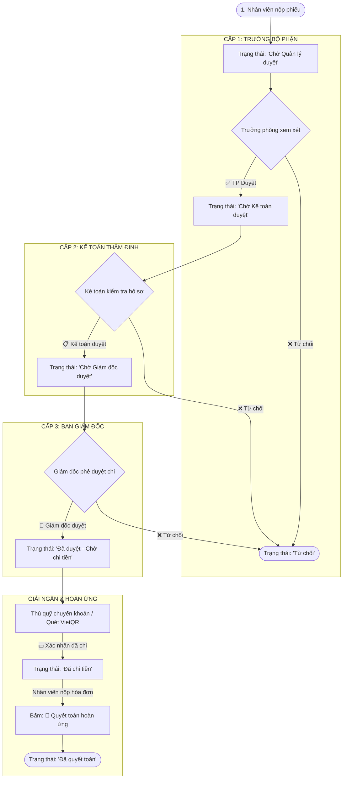

# HƯỚNG DẪN TOÀN DIỆN CẤU HÌNH APPSHEET: QUẢN LÝ & PHÊ DUYỆT PHIẾU TẠM ỨNG
### (Phê duyệt 3 cấp • Giải ngân VietQR • Quyết toán hoàn ứng • Tự động gửi Email & Xuất PDF)

Tài liệu này tổng hợp toàn bộ các bước thiết lập thực tế, bao gồm cả những lưu ý quan trọng để tránh các lỗi thường gặp trong quá trình cấu hình AppSheet.

---

## 📑 MỤC LỤC
1. [Sơ đồ Luồng duyệt & Phân quyền](#1-sơ-đồ-luồng-duyệt--phân-quyền)
2. [Phần 1: Chuẩn bị Google Sheets & Cài đặt Apps Script](#phần-1-chuẩn-bị-google-sheets--cài-đặt-apps-script)
3. [Phần 2: Nạp bảng & Tạo quan hệ Master-Detail](#phần-2-nạp-bảng--tạo-quan-hệ-master-detail)
4. [Phần 3: Cấu hình thuộc tính các cột (Khắc phục lỗi thường gặp)](#phần-3-cấu-hình-thuộc-tính-các-cột)
5. [Phần 4: Thiết lập Phân quyền Người dùng (Roles & RBAC)](#phần-4-thiết-lập-phân-quyền-người-dùng)
6. [Phần 5: Tạo các Nút bấm Phê duyệt 1 chạm (Actions)](#phần-5-tạo-các-nút-bấm-phê-duyệt-1-chạm-actions)
7. [Phần 6: Thiết lập Bộ lọc hiển thị (Slices)](#phần-6-thiết-lập-bộ-lọc-hiển-thị-slices)
8. [Phần 7: Thiết kế Giao diện người dùng (UX Views, Group By, Badge)](#phần-7-thiết-kế-giao-diện-người-dùng-ux-views)
9. [Phần 8: Tự động hóa Gửi Email & Xuất PDF (Automations)](#phần-8-tự-động-hóa-gửi-email--xuất-pdf-automations)
10. [Phần 9: Hướng dẫn Kiểm thử Vận hành (Testing Guide)](#phần-9-hướng-dẫn-kiểm-thử-vận-hành)

---

## 1. SƠ ĐỒ LUỒNG DUYỆT & PHÂN QUYỀN



---

## PHẦN 1: CHUẨN BỊ GOOGLE SHEETS & CÀI ĐẶT APPS SCRIPT

### Bước 1: Tạo Google Sheet
1. Tạo một bảng tính mới tại [Google Sheets](https://sheets.google.com) với tên: **`QUAN_LY_TAM_UNG_CONG_TY`**.
2. Tạo đủ 4 trang tính (tabs) và dán nội dung từ các file CSV mẫu tương ứng:
   - **Tab 1: `PHIEU_TAM_UNG`** *(Lấy từ [PHIEU_TAM_UNG.csv](./PHIEU_TAM_UNG.csv))*
   - **Tab 2: `CHI_TIET_TAM_UNG`** *(Lấy từ [CHI_TIET_TAM_UNG.csv](./CHI_TIET_TAM_UNG.csv))*
   - **Tab 3: `DANH_MUC_NHAN_VIEN`** *(Lấy từ [DANH_MUC_NHAN_VIEN.csv](./DANH_MUC_NHAN_VIEN.csv))*
   - **Tab 4: `DANH_MUC_HANG_MUC`** *(Lấy từ [DANH_MUC_HANG_MUC.csv](./DANH_MUC_HANG_MUC.csv))*

### Bước 2: Cài đặt Apps Script tự động hóa
1. Trên Google Sheets, chọn **Tiện ích mở rộng (Extensions)** ➔ **Apps Script**.
2. Xóa hết mã cũ và dán toàn bộ mã từ tệp [`Code.gs`](./Code.gs).
3. Đặt tên dự án là `QuanLyTamUngScript` và bấm **Save (Ctrl + S)**.
4. Tải lại trang Google Sheet (F5) ➔ Xuất hiện menu: **`💰 Quản Lý Phiếu Tạm Ứng`**.
5. Bấm chọn **`⚡ Cài đặt Trigger tự động khi AppSheet thêm phiếu`** (cấp quyền truy cập khi được hỏi).

---

## PHẦN 2: NẠP BẢNG & TẠO QUAN HỆ MASTER-DETAIL

1. Trên Google Sheets, chọn **Tiện ích mở rộng** ➔ **AppSheet** ➔ **Tạo ứng dụng (Create an app)**.
2. Tại màn hình AppSheet, vào mục **Data**:
   - Thêm đủ 4 bảng: `PHIEU_TAM_UNG`, `CHI_TIET_TAM_UNG`, `DANH_MUC_NHAN_VIEN`, `DANH_MUC_HANG_MUC`.
3. **Thiết lập quan hệ Cha - Con (Master-Detail):**
   - Vào bảng **`CHI_TIET_TAM_UNG`** ➔ Chọn cột **`MaPhieu`**:
     - **Type**: Đổi thành **`Ref`**.
     - **ReferencedTableName**: Chọn **`PHIEU_TAM_UNG`**.
     - **Tick chọn ô `IsPartOf`**: *Bắt buộc tick chọn ô này để khi nhân viên tạo phiếu tạm ứng, danh sách các khoản chi tiết được hiển thị lồng ngay trong form!*
   - Bấm nút **SAVE** màu xanh ở góc trên bên phải màn hình.

---

## PHẦN 3: CẤU HÌNH THUỘC TÍNH CÁC CỘT

Vào **Data** ➔ Chọn bảng **`PHIEU_TAM_UNG`**:

### 1. Cột `SoTienTamUng` (Tính tổng & Đơn vị tiền tệ VNĐ)
- **Type**: Chọn **`Price`**.
- **Cách đặt công thức tính tổng (Tránh lỗi không tìm thấy cột ảo):**
  - Mở ô **App Formula** (hoặc Initial value), dán công thức chuẩn:
    ```excel
    SUM(SELECT(CHI_TIET_TAM_UNG[SoTien], [MaPhieu] = [_THISROW].[MaPhieu]))
    ```
- **Đổi sang tiền tệ Việt Nam (VNĐ / ₫):**
  - Bấm vào biểu tượng chiếc bút ✏️ bên cạnh `SoTienTamUng` để mở cài đặt chi tiết.
  - Cuộn xuống mục **Type Details**:
    - **Currency symbol**: Xóa dấu `$` đi, đổi thành: **`₫`** hoặc **`VND`**.
    - **Decimal digits**: Đổi từ `2` thành **`0`** (tiền Việt không dùng số lẻ).

### 2. Cột `SoTienBangChu` (Số tiền bằng chữ)
- **Type**: **`Text`**.
- **App Formula**: **ĐỂ TRỐNG HOÀN TOÀN** (không nhập gì).
- **Initial value**: **ĐỂ TRỐNG**.
- **Editable?**: Bỏ tick (hoặc để trống để người dùng không gõ tay, script trong `Code.gs` sẽ tự động đọc số thành chữ khi lưu phiếu).

### 3. Cột `HanQuyetToan` (Hạn hoàn ứng / quyết toán)
- **Type**: **`Date`**.
- **Require?**: **Tick chọn** (Bắt buộc).
- **Initial value**: `TODAY() + 7` (Tự động gợi ý hạn thanh toán là 7 ngày sau).
- **Chặn chọn ngày sai (Data Validity):**
  - Bấm vào biểu tượng ✏️ ➔ Cuộn xuống **Data Validity**:
  - **Valid_If**: `[_THIS] >= [NgayDeNghi]`
  - **Invalid value error**: `"⚠️ Hạn hoàn ứng không được nhỏ hơn ngày đề nghị!"`

### 4. Cột `TrangThai` (LƯU Ý CỰC KỲ QUAN TRỌNG ĐỂ KHÔNG BỊ ẨN TRONG ACTION)
> [!CAUTION]
> **Tuyệt đối không bỏ tick Editable? và không nhập vào App Formula của cột `TrangThai`!** Nếu bỏ tick hoặc có App Formula, AppSheet sẽ coi đây là cột chỉ đọc và ẩn cột này khỏi danh sách chọn của Action!

- **Type**: **`Enum`**.
  - Values: `Nháp`, `Chờ Quản lý duyệt`, `Chờ Kế toán duyệt`, `Chờ Giám đốc duyệt`, `Đã duyệt - Chờ chi tiền`, `Đã chi tiền`, `Đã quyết toán`, `Từ chối`.
- **App Formula**: **ĐỂ TRỐNG HOÀN TOÀN**.
- **Initial value**: `"Chờ Quản lý duyệt"`.
- **Editable?**: **PHẢI TICK CHỌN (TRUE)**.
- **Để cấm nhân viên tự sửa trong Form (Tùy chọn nâng cao):**
  - Bấm biểu tượng ✏️ ➔ Cuộn xuống **Update, Insert, Delete** ➔ Tìm ô **Editable?** ➔ Dán công thức:
    ```excel
    CONTEXT("ViewType") <> "Form"
    ```

---

## PHẦN 4: THIẾT LẬP PHÂN QUYỀN NGƯỜI DÙNG (ROLES & RBAC)

Hệ thống nhận diện người đăng nhập qua `USEREMAIL()` và đối chiếu với bảng `DANH_MUC_NHAN_VIEN`:

1. Bảng **`DANH_MUC_NHAN_VIEN`**:
   - Cột **`Email`**: Type `Email`, tick chọn **Key**.
   - Cột **`VaiTro`**: Type `Enum` gồm 4 giá trị: `NhanVien`, `TruongBoPhan`, `KeToan`, `GiamDoc`.
2. **Công thức tra cứu quyền hạn được sử dụng trong hệ thống:**
   - Kiểm tra vai trò của người đang mở app:
     ```excel
     LOOKUP(USEREMAIL(), "DANH_MUC_NHAN_VIEN", "Email", "VaiTro")
     ```
   - Kiểm tra người đang mở app có phải Quản lý trực tiếp của người tạo phiếu không:
     ```excel
     LOOKUP([EmailNhanVien], "DANH_MUC_NHAN_VIEN", "Email", "EmailQuanLyTrucTiep") = USEREMAIL()
     ```

---

## PHẦN 5: TẠO CÁC NÚT BẤM PHÊ DUYỆT 1 CHẠM (ACTIONS)

Vào mục **Actions** (biểu tượng mũi tên hoặc trong menu **Behaviors**) ➔ Chọn bảng **`PHIEU_TAM_UNG`** ➔ Bấm **+ Add Action**:

### Action 1: `Trưởng Phòng Duyệt`
- **Action name**: `TP_Duyet`
- **Do this**: `Data: set the values of some columns in this row`
- **Set these columns**:
  - `TrangThai` = `"Chờ Kế toán duyệt"`
  - `NguoiDuyetCap1` = `USEREMAIL()`
  - `NgayDuyetCap1` = `NOW()`
- **Only if this condition is true**:
  ```excel
  AND(
    [TrangThai] = "Chờ Quản lý duyệt",
    OR(
      LOOKUP(USEREMAIL(), "DANH_MUC_NHAN_VIEN", "Email", "VaiTro") = "TruongBoPhan",
      LOOKUP(USEREMAIL(), "DANH_MUC_NHAN_VIEN", "Email", "VaiTro") = "GiamDoc",
      LOOKUP([EmailNhanVien], "DANH_MUC_NHAN_VIEN", "Email", "EmailQuanLyTrucTiep") = USEREMAIL()
    )
  )
  ```
- **Appearance**: Display name: `✅ Duyệt (Trưởng phòng)`, Icon: `check-circle`.

### Action 2: `Kế Toán Kiểm Tra & Duyệt`
- **Action name**: `KeToan_Duyet`
- **Do this**: `Data: set the values of some columns in this row`
- **Set these columns**:
  - `TrangThai` = `"Chờ Giám đốc duyệt"`
  - `NguoiDuyetCap2` = `USEREMAIL()`
  - `NgayDuyetCap2` = `NOW()`
- **Only if this condition is true**:
  ```excel
  AND(
    [TrangThai] = "Chờ Kế toán duyệt",
    OR(
      LOOKUP(USEREMAIL(), "DANH_MUC_NHAN_VIEN", "Email", "VaiTro") = "KeToan",
      LOOKUP(USEREMAIL(), "DANH_MUC_NHAN_VIEN", "Email", "VaiTro") = "GiamDoc"
    )
  )
  ```
- **Appearance**: Display name: `📋 Kế toán duyệt`, Icon: `file-check`.

### Action 3: `Giám Đốc Phê Duyệt`
- **Action name**: `GiamDoc_Duyet`
- **Do this**: `Data: set the values of some columns in this row`
- **Set these columns**:
  - `TrangThai` = `"Đã duyệt - Chờ chi tiền"`
  - `NguoiDuyetCap3` = `USEREMAIL()`
  - `NgayDuyetCap3` = `NOW()`
- **Only if this condition is true**:
  ```excel
  AND(
    [TrangThai] = "Chờ Giám đốc duyệt",
    LOOKUP(USEREMAIL(), "DANH_MUC_NHAN_VIEN", "Email", "VaiTro") = "GiamDoc"
  )
  ```
- **Appearance**: Display name: `👑 Giám đốc phê duyệt`, Icon: `shield-check`.

### Action 4: `Từ Chối Phiếu` (Dùng chung cho cả 3 cấp)
- **Action name**: `Tu_Choi_Phieu`
- **Do this**: `Data: set the values of some columns in this row`
- **Set these columns**:
  - `TrangThai` = `"Từ chối"`
- **Only if this condition is true**:
  ```excel
  AND(
    IN([TrangThai], LIST("Chờ Quản lý duyệt", "Chờ Kế toán duyệt", "Chờ Giám đốc duyệt")),
    OR(
      LOOKUP(USEREMAIL(), "DANH_MUC_NHAN_VIEN", "Email", "VaiTro") = "TruongBoPhan",
      LOOKUP(USEREMAIL(), "DANH_MUC_NHAN_VIEN", "Email", "VaiTro") = "KeToan",
      LOOKUP(USEREMAIL(), "DANH_MUC_NHAN_VIEN", "Email", "VaiTro") = "GiamDoc"
    )
  )
  ```
- **Appearance**: Display name: `❌ Từ chối`, Color: Màu đỏ (Highlight).

### Action 5: `Xác Nhận Đã Chi Tiền` (Thủ quỹ / Kế toán)
- **Action name**: `ThuQuy_DaChiTien`
- **Do this**: `Data: set the values of some columns in this row`
- **Set these columns**:
  - `TrangThai` = `"Đã chi tiền"`
  - `NgayChiTien` = `TODAY()`
  - `NguoiChiTien` = `LOOKUP(USEREMAIL(), "DANH_MUC_NHAN_VIEN", "Email", "HoTen")`
- **Only if this condition is true**:
  ```excel
  AND(
    [TrangThai] = "Đã duyệt - Chờ chi tiền",
    OR(
      LOOKUP(USEREMAIL(), "DANH_MUC_NHAN_VIEN", "Email", "VaiTro") = "KeToan",
      LOOKUP(USEREMAIL(), "DANH_MUC_NHAN_VIEN", "Email", "VaiTro") = "GiamDoc"
    )
  )
  ```
- **Appearance**: Display name: `💵 Xác nhận đã chi tiền`, Icon: `cash-register`.

---

## PHẦN 6: THIẾT LẬP BỘ LỌC HIỂN THỊ (SLICES)

### 📍 Cách tìm mục Slices trên giao diện:
- **Cách 1:** Vào **Data** ➔ Bấm vào **dấu 3 chấm (`...`)** ngay cạnh tên bảng `PHIEU_TAM_UNG` ➔ Chọn **`Create a slice`**.
- **Cách 2:** Vào **Data** ➔ Nhìn vào cột danh mục bên cạnh, cuộn xuống dưới mục *Tables* sẽ thấy chữ **`Slices`**.

### 1. Slice: `Phieu_Cua_Toi` (Dành cho nhân viên)
- **Slice Name**: `Phieu_Cua_Toi`
- **Table**: `PHIEU_TAM_UNG`
- **Row filter condition**:
  ```excel
  [EmailNhanVien] = USEREMAIL()
  ```

### 2. Slice: `Cho_Toi_Duyet` (Dành cho người duyệt)
- **Slice Name**: `Cho_Toi_Duyet`
- **Table**: `PHIEU_TAM_UNG`
- **Row filter condition**:
  ```excel
  OR(
    AND(
      [TrangThai] = "Chờ Quản lý duyệt",
      LOOKUP(USEREMAIL(), "DANH_MUC_NHAN_VIEN", "Email", "VaiTro") = "TruongBoPhan"
    ),
    AND(
      [TrangThai] = "Chờ Kế toán duyệt",
      LOOKUP(USEREMAIL(), "DANH_MUC_NHAN_VIEN", "Email", "VaiTro") = "KeToan"
    ),
    AND(
      [TrangThai] = "Chờ Giám đốc duyệt",
      LOOKUP(USEREMAIL(), "DANH_MUC_NHAN_VIEN", "Email", "VaiTro") = "GiamDoc"
    )
  )
  ```

---

## PHẦN 7: THIẾT KẾ GIAO DIỆN NGƯỜI DÙNG (UX VIEWS)

Vào **UX** ➔ **Views**:

### 1. View 1: `Phiếu của tôi` (Bottom bar - vị trí 1)
- **For this data**: Chọn Slice **`Phieu_Cua_Toi`**.
- **View type**: `deck` hoặc `table`.
- **Position**: `first`.

### 2. View 2: `Cần tôi duyệt` (Bottom bar - vị trí 2 kèm Badge số đếm)
- **For this data**: Chọn Slice **`Cho_Toi_Duyet`**.
- **View type**: `card` hoặc `deck`.
- **Position**: `middle`.
- **Thiết lập Badge số đếm (Display name):**
  - Cuộn xuống mục **Display** ➔ Ô **Display name** ➔ Bấm vào biểu tượng bình mực / công thức và dán:
    ```excel
    IF(
      COUNT(Cho_Toi_Duyet[MaPhieu]) > 0,
      CONCATENATE("Cần duyệt (", COUNT(Cho_Toi_Duyet[MaPhieu]), ")"),
      "Cần duyệt"
    )
    ```

### 3. View 3: `Tất cả phiếu` (Quản trị & Gom nhóm Group By)
- **For this data**: Chọn Table **`PHIEU_TAM_UNG`**.
- **View type**: `table`.
- **Position**: `menu` (hoặc `ref`).
- **Group by (Gom nhóm theo tầng):**
  - Trong mục **View Options**:
    - Dòng 1: Chọn cột **`TrangThai`**.
    - Dòng 2: Bấm `Add` chọn cột **`BoPhan`**.
  - **Group aggregate**: Chọn **`SUM::SoTienTamUng`** (Tự động tính tổng tiền của từng nhóm).
- **Phân quyền ẩn màn hình (Show if):**
  ```excel
  LOOKUP(USEREMAIL(), "DANH_MUC_NHAN_VIEN", "Email", "VaiTro") <> "NhanVien"
  ```
  *(Chỉ sếp mới thấy toàn bộ phiếu, nhân viên thường bị ẩn)*.

---

## PHẦN 8: TỰ ĐỘNG HÓA GỬI EMAIL & XUẤT PDF (AUTOMATIONS)

Vào mục **Automations** (biểu tượng Robot / Tia sét) ➔ **Bots**:

### Bot 1: Gửi Email cho Quản lý khi có phiếu mới
1. Bấm **+ Create a new bot** ➔ Đổi tên: `Bot_GuiEmail_PhieuMoi`.
2. **Event**:
   - Event Type: `Data Change` ➔ Table: `PHIEU_TAM_UNG` ➔ Type: `Adds only`.
3. **Step**:
   - Task: `Send an email`.
   - **To**: `LIST(LOOKUP([EmailNhanVien], "DANH_MUC_NHAN_VIEN", "Email", "EmailQuanLyTrucTiep"))`.
   - **Subject**: `[Tạm Ứng] Đề nghị tạm ứng mới từ <<[HoTenNhanVien]>> - Phiếu <<[MaPhieu]>>`.
   - **Body**:
     ```text
     Kính gửi Quản lý,
     Nhân viên <<[HoTenNhanVien]>> vừa gửi yêu cầu tạm ứng số tiền: <<[SoTienTamUng]>> VNĐ.
     Lý do: <<[LyDoTamUng]>>
     Hạn hoàn ứng: <<[HanQuyetToan]>>
     Vui lòng mở ứng dụng AppSheet để phê duyệt phiếu.
     ```

### Bot 2: Tự động xuất File PDF khi Giám Đốc Phê Duyệt
1. Bấm **+ Create a new bot** ➔ Đổi tên: `Bot_XuatPDF_KhiGiamDocDuyet`.
2. **Event**:
   - Event Type: `Data Change` ➔ Table: `PHIEU_TAM_UNG` ➔ Type: `Updates only`.
   - **Condition**:
     ```excel
     AND(
       [_THISROW_BEFORE].[TrangThai] <> "Đã duyệt - Chờ chi tiền",
       [_THISROW_AFTER].[TrangThai] = "Đã duyệt - Chờ chi tiền"
     )
     ```
3. **Step**:
   - Task: `Create a new file`.
   - File type: `PDF` ➔ Bấm chữ **Create** ở mục Template để tạo mẫu Google Docs.
   - **File name prefix**: `CONCATENATE("PhieuTamUng_", [MaPhieu], "_", [HoTenNhanVien])`.
   - **Disable Image Timestamp?**: Chọn **`ON`**.

---

## PHẦN 9: HƯỚNG DẪN KIỂM THỬ VẬN HÀNH (TESTING GUIDE)

Sử dụng thanh **Preview as** ở đáy màn hình điện thoại giả lập bên phải để kiểm thử:

1. **Màn 1 - Nhân viên (`nguyenvana@congty.com`):**
   - Bấm `+` tạo phiếu, nhập lý do và thêm 2 khoản chi trong bảng con.
   - Kiểm tra tổng tiền tự nhảy. Bấm Save ➔ Phiếu ở trạng thái `Chờ Quản lý duyệt` và không có nút duyệt nào.
2. **Màn 2 - Trưởng phòng (`truongphong_kd@congty.com`):**
   - Tab `Cần duyệt (1)` xuất hiện ➔ Mở phiếu bấm **`✅ Duyệt (Trưởng phòng)`** ➔ Trạng thái chuyển sang `Chờ Kế toán duyệt`.
3. **Màn 3 - Kế toán (`ketoan@congty.com`):**
   - Mở phiếu bấm **`📋 Kế toán duyệt`** ➔ Trạng thái chuyển sang `Chờ Giám đốc duyệt`.
4. **Màn 4 - Giám đốc (`giamdoc@congty.com`):**
   - Mở phiếu bấm **`👑 Giám đốc phê duyệt`** ➔ Phiếu chuyển sang `Đã duyệt - Chờ chi tiền` và file PDF tự động sinh ra trên Google Drive!
5. **Màn 5 - Thủ quỹ (`ketoan@congty.com`):**
   - Bấm **`💵 Xác nhận đã chi tiền`** ➔ Phiếu hoàn tất giải ngân chuyển sang `Đã chi tiền`.
