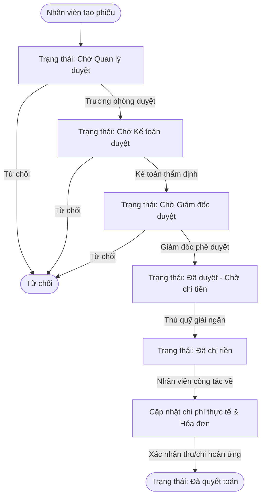

# HƯỚNG DẪN CHI TIẾT CẤU HÌNH APPSHEET: QUẢN LÝ & DUYỆT PHIẾU TẠM ỨNG
### (Phê duyệt đa cấp: Trưởng phòng ➔ Kế toán ➔ Ban Giám Đốc ➔ Thủ quỹ chi tiền ➔ Quyết toán hoàn ứng)

Tài liệu này hướng dẫn chi tiết từ A-Z cách xây dựng ứng dụng Google AppSheet quản lý và phê duyệt phiếu tạm ứng nội bộ doanh nghiệp, kết nối dữ liệu Google Sheets và tự động hóa qua Google Apps Script.

---

## 📑 MỤC LỤC
1. [Tổng quan luồng phê duyệt & Các vai trò](#1-tổng-quan-luồng-phê-duyệt)
2. [Phần 1: Chuẩn bị Google Sheets & Cài đặt Apps Script](#phần-1-chuẩn-bị-google-sheets--cài-đặt-apps-script)
3. [Phần 2: Khởi tạo ứng dụng AppSheet & Liên kết các bảng](#phần-2-khởi-tạo-ứng-dụng-appsheet--liên-kết-các-bảng)
4. [Phần 3: Cấu hình chi tiết thuộc tính các cột (Data > Columns)](#phần-3-cấu-hình-chi-tiết-thuộc-tính-các-cột)
5. [Phần 4: Thiết lập Phân quyền người dùng (Security & Roles)](#phần-4-thiết-lập-phân-quyền-người-dùng)
6. [Phần 5: Tạo các Nút bấm phê duyệt 1 chạm (Actions)](#phần-5-tạo-các-nút-bấm-phê-duyệt-1-chạm-actions)
7. [Phần 6: Thiết lập Bộ lọc hiển thị (Slices)](#phần-6-thiết-lập-bộ-lọc-hiển-thị-slices)
8. [Phần 7: Thiết kế Giao diện người dùng (UX Views)](#phần-7-thiết-kế-giao-diện-người-dùng-ux-views)
9. [Phần 8: Tự động hóa gửi thông báo & Xuất PDF (Automations)](#phần-8-tự-động-hóa-gửi-thông-báo--xuất-pdf-automations)

---

## 1. TỔNG QUAN LUỒNG PHÊ DUYỆT



- **Nhân viên (NhanVien)**: Tạo phiếu, nhập các dòng chi tiết, theo dõi tiến độ, nộp hóa đơn quyết toán.
- **Trưởng bộ phận (TruongBoPhan)**: Kiểm tra tính hợp lý của công việc, duyệt hoặc từ chối phiếu của nhân viên trong nhóm.
- **Kế toán (KeToan)**: Kiểm tra định mức, dự toán ngân sách, hồ sơ đính kèm và tài khoản nhận tiền.
- **Giám đốc (GiamDoc)**: Phê duyệt chuẩn chi ngân sách công ty.
- **Thủ quỹ (ThuQuy)**: Thực hiện chi tiền mặt hoặc chuyển khoản ngân hàng.

---

## PHẦN 1: CHUẨN BỊ GOOGLE SHEETS & CÀI ĐẶT APPS SCRIPT

### Bước 1: Tạo bảng tính Google Sheet
1. Mở [Google Sheets](https://sheets.google.com) và tạo một bảng tính mới với tên: **`QUAN_LY_TAM_UNG_CONG_TY`**.
2. Tạo 4 trang tính (tabs) và nhập đúng tiêu đề các cột như sau:

#### Tab 1: `PHIEU_TAM_UNG`
Sao chép dòng tiêu đề từ tệp [PHIEU_TAM_UNG.csv](./PHIEU_TAM_UNG.csv):
> `MaPhieu` | `NgayDeNghi` | `EmailNhanVien` | `HoTenNhanVien` | `BoPhan` | `ChucVu` | `SoTienTamUng` | `SoTienBangChu` | `LyDoTamUng` | `HanQuyetToan` | `HinhThucNhan` | `SoTaiKhoan` | `NganHang` | `ChuTaiKhoan` | `ChungTuDinhKem` | `TrangThai` | `NguoiDuyetCap1` | `NgayDuyetCap1` | `NhanXetCap1` | `NguoiDuyetCap2` | `NgayDuyetCap2` | `NhanXetCap2` | `NguoiDuyetCap3` | `NgayDuyetCap3` | `NhanXetCap3` | `NgayChiTien` | `NguoiChiTien` | `NgayQuyetToan` | `SoTienThucChi` | `TienThuaThieu` | `GhiChuQuyetToan`

#### Tab 2: `CHI_TIET_TAM_UNG`
Sao chép dòng tiêu đề từ tệp [CHI_TIET_TAM_UNG.csv](./CHI_TIET_TAM_UNG.csv):
> `ID` | `MaPhieu` | `HangMucChi` | `SoTien` | `GhiChu`

#### Tab 3: `DANH_MUC_NHAN_VIEN`
Sao chép dòng tiêu đề từ tệp [DANH_MUC_NHAN_VIEN.csv](./DANH_MUC_NHAN_VIEN.csv):
> `Email` | `HoTen` | `BoPhan` | `ChucVu` | `VaiTro` | `SoTaiKhoan` | `NganHang` | `EmailQuanLyTrucTiep`

#### Tab 4: `DANH_MUC_HANG_MUC`
Sao chép dòng tiêu đề từ tệp [DANH_MUC_HANG_MUC.csv](./DANH_MUC_HANG_MUC.csv):
> `MaHangMuc` | `TenHangMuc` | `MoTa`

### Bước 2: Cài đặt Apps Script tiện ích & Mẫu in 03-TT
1. Trên Google Sheets, chọn **Tiện ích mở rộng (Extensions)** ➔ **Apps Script**.
2. Xóa hết mã cũ và dán toàn bộ nội dung từ tệp [Code.gs](./Code.gs).
3. Đặt tên dự án là `QuanLyTamUngScript` và bấm **Save (Ctrl + S)**.
4. Tải lại trang Google Sheet (F5) ➔ Xuất hiện menu: **`💰 Quản Lý Phiếu Tạm Ứng`**.
5. Bấm chọn **`⚡ Cài đặt Trigger tự động khi AppSheet thêm phiếu`** để kích hoạt tự động điền số tiền bằng chữ và gửi email.

---

## PHẦN 2: KHỞI TẠO ỨNG DỤNG APPSHEET & LIÊN KẾT CÁC BẢNG

1. Trên Google Sheets, bấm **Tiện ích mở rộng (Extensions)** ➔ **AppSheet** ➔ **Tạo ứng dụng (Create an app)**.
2. Tại màn hình AppSheet, vào menu **Data**:
   - Thêm bảng chính: **`PHIEU_TAM_UNG`**.
   - Bấm **Add Table** để thêm tiếp 3 bảng còn lại: **`CHI_TIET_TAM_UNG`**, **`DANH_MUC_NHAN_VIEN`**, **`DANH_MUC_HANG_MUC`**.
3. **Thiết lập quan hệ cha-con (Master-Detail)**:
   - Trong bảng `CHI_TIET_TAM_UNG`, chọn cột `MaPhieu`:
     - **Type**: `Ref`
     - **ReferencedTableName**: `PHIEU_TAM_UNG`
     - **Tick chọn**: `IsPartOf` (để khi tạo phiếu tạm ứng, người dùng có thể thêm nhiều dòng chi tiết ngay trong form).

---

## PHẦN 3: CẤU HÌNH CHI TIẾT THUỘC TÍNH CÁC CỘT

### 1. Bảng `PHIEU_TAM_UNG`

| Tên Cột | Data Type | Key/Label | Cấu hình quan trọng |
| :--- | :--- | :--- | :--- |
| **`MaPhieu`** | Text | **Key & Label** | - Initial Value: `CONCATENATE("TU", TEXT(TODAY(), "YYMM"), "-", RIGHT(CONCATENATE("0000", UNIQUEID()), 4))`<br>- Editable: `FALSE` |
| **`NgayDeNghi`** | Date | | - Initial Value: `TODAY()`<br>- Editable: `FALSE` |
| **`EmailNhanVien`** | Email | | - Initial Value: `USEREMAIL()`<br>- Editable: `FALSE` |
| **`HoTenNhanVien`** | Text | | - Initial Value: `LOOKUP(USEREMAIL(), "DANH_MUC_NHAN_VIEN", "Email", "HoTen")` |
| **`BoPhan`** | Text / Enum | | - Initial Value: `LOOKUP(USEREMAIL(), "DANH_MUC_NHAN_VIEN", "Email", "BoPhan")` |
| **`ChucVu`** | Text | | - Initial Value: `LOOKUP(USEREMAIL(), "DANH_MUC_NHAN_VIEN", "Email", "ChucVu")` |
| **`SoTienTamUng`** | Price | | - Currency: `VND` (hoặc `₫`)<br>- Initial Value / Formula: `SUM([Related CHI_TIET_TAM_UNGs][SoTien])` |
| **`LyDoTamUng`** | LongText | | - Required: `TRUE` |
| **`HanQuyetToan`** | Date | | - Required: `TRUE`<br>- Valid_If: `[_THIS] >= [NgayDeNghi]` (Không chọn hạn thanh toán nhỏ hơn ngày tạo) |
| **`HinhThucNhan`** | Enum | | - Values: `Chuyển khoản`, `Tiền mặt` |
| **`SoTaiKhoan`** | Text | | - Show_If: `[HinhThucNhan] = "Chuyển khoản"`<br>- Initial Value: `LOOKUP(USEREMAIL(), "DANH_MUC_NHAN_VIEN", "Email", "SoTaiKhoan")` |
| **`NganHang`** | Text | | - Show_If: `[HinhThucNhan] = "Chuyển khoản"`<br>- Initial Value: `LOOKUP(USEREMAIL(), "DANH_MUC_NHAN_VIEN", "Email", "NganHang")` |
| **`ChuTaiKhoan`** | Text | | - Show_If: `[HinhThucNhan] = "Chuyển khoản"`<br>- Initial Value: `UPPER([HoTenNhanVien])` |
| **`ChungTuDinhKem`** | File / Image | | - Tải hóa đơn, báo giá, kế hoạch công tác |
| **`TrangThai`** | Enum | | - Values: `Nháp`, `Chờ Quản lý duyệt`, `Chờ Kế toán duyệt`, `Chờ Giám đốc duyệt`, `Đã duyệt - Chờ chi tiền`, `Đã chi tiền`, `Đã quyết toán`, `Từ chối`<br>- Initial Value: `"Chờ Quản lý duyệt"`<br>- Editable: `FALSE` (Chỉ thay đổi qua các Actions) |
| **`NguoiDuyetCap1`** | Email | | - Show_If: `ISNOTBLANK([NguoiDuyetCap1])` |
| **`NgayDuyetCap1`** | DateTime | | - Show_If: `ISNOTBLANK([NgayDuyetCap1])` |
| **`NhanXetCap1`** | Text | | - Show_If: `ISNOTBLANK([NhanXetCap1])` |
| **`NguoiDuyetCap2`** | Email | | - Show_If: `ISNOTBLANK([NguoiDuyetCap2])` |
| **`NgayDuyetCap2`** | DateTime | | - Show_If: `ISNOTBLANK([NgayDuyetCap2])` |
| **`NhanXetCap2`** | Text | | - Show_If: `ISNOTBLANK([NhanXetCap2])` |
| **`NguoiDuyetCap3`** | Email | | - Show_If: `ISNOTBLANK([NguoiDuyetCap3])` |
| **`NgayDuyetCap3`** | DateTime | | - Show_If: `ISNOTBLANK([NgayDuyetCap3])` |
| **`NhanXetCap3`** | Text | | - Show_If: `ISNOTBLANK([NhanXetCap3])` |
| **`NgayChiTien`** | Date | | - Show_If: `ISNOTBLANK([NgayChiTien])` |
| **`NguoiChiTien`** | Text | | - Show_If: `ISNOTBLANK([NguoiChiTien])` |
| **`SoTienThucChi`** | Price | | - Show_If: `[TrangThai] = "Đã quyết toán" OR [TrangThai] = "Đã chi tiền"` |
| **`TienThuaThieu`** | Price | | - Formula: `[SoTienTamUng] - [SoTienThucChi]` |
| **`GhiChuQuyetToan`** | LongText | | - Show_If: `[TrangThai] = "Đã quyết toán" OR [TrangThai] = "Đã chi tiền"` |

---

## PHẦN 4: THIẾT LẬP PHÂN QUYỀN NGƯỜI DÙNG

Tại AppSheet, người dùng đăng nhập bằng tài khoản Google. Để phân quyền động theo bảng `DANH_MUC_NHAN_VIEN`:

1. Thêm một **User Setting** hoặc kiểm tra trực tiếp qua biểu thức:
   ```excel
   LOOKUP(USEREMAIL(), "DANH_MUC_NHAN_VIEN", "Email", "VaiTro")
   ```
2. Các vai trò chuẩn:
   - `"TruongBoPhan"`: Trưởng phòng của nhân viên đó.
   - `"KeToan"`: Bộ phận Kế toán / Kế toán trưởng / Thủ quỹ.
   - `"GiamDoc"`: Ban Giám Đốc.
   - `"NhanVien"`: Nhân viên thông thường.

---

## PHẦN 5: TẠO CÁC NÚT BẤM PHÊ DUYỆT 1 CHẠM (ACTIONS)

Vào mục **Behaviors** ➔ **Actions** ➔ Bấm **+ Add Action** cho bảng `PHIEU_TAM_UNG`:

### 1. Action: `Trưởng Phòng Duyệt`
- **Action name**: `TP_Duyet`
- **For a record of table**: `PHIEU_TAM_UNG`
- **Do this**: `Data: set the values of some columns in this row`
- **Set columns**:
  - `TrangThai` = `"Chờ Kế toán duyệt"`
  - `NguoiDuyetCap1` = `USEREMAIL()`
  - `NgayDuyetCap1` = `NOW()`
- **Only if this condition is true**:
  ```excel
  AND(
    [TrangThai] = "Chờ Quản lý duyệt",
    OR(
      LOOKUP(USEREMAIL(), "DANH_MUC_NHAN_VIEN", "Email", "VaiTro") = "TruongBoPhan",
      LOOKUP(USEREMAIL(), "DANH_MUC_NHAN_VIEN", "Email", "VaiTro") = "GiamDoc",
      LOOKUP([EmailNhanVien], "DANH_MUC_NHAN_VIEN", "Email", "EmailQuanLyTrucTiep") = USEREMAIL()
    )
  )
  ```
- **Appearance**: Icon `check-circle`, Display name: `✅ Duyệt (Trưởng phòng)`

### 2. Action: `Kế Toán Kiểm Tra & Duyệt`
- **Action name**: `KeToan_Duyet`
- **For a record of table**: `PHIEU_TAM_UNG`
- **Do this**: `Data: set the values of some columns in this row`
- **Set columns**:
  - `TrangThai` = `"Chờ Giám đốc duyệt"`
  - `NguoiDuyetCap2` = `USEREMAIL()`
  - `NgayDuyetCap2` = `NOW()`
- **Only if this condition is true**:
  ```excel
  AND(
    [TrangThai] = "Chờ Kế toán duyệt",
    OR(
      LOOKUP(USEREMAIL(), "DANH_MUC_NHAN_VIEN", "Email", "VaiTro") = "KeToan",
      LOOKUP(USEREMAIL(), "DANH_MUC_NHAN_VIEN", "Email", "VaiTro") = "GiamDoc"
    )
  )
  ```
- **Appearance**: Icon `file-check`, Display name: `📋 Kế toán duyệt`

### 3. Action: `Giám Đốc Phê Duyệt`
- **Action name**: `GiamDoc_Duyet`
- **For a record of table**: `PHIEU_TAM_UNG`
- **Do this**: `Data: set the values of some columns in this row`
- **Set columns**:
  - `TrangThai` = `"Đã duyệt - Chờ chi tiền"`
  - `NguoiDuyetCap3` = `USEREMAIL()`
  - `NgayDuyetCap3` = `NOW()`
- **Only if this condition is true**:
  ```excel
  AND(
    [TrangThai] = "Chờ Giám đốc duyệt",
    LOOKUP(USEREMAIL(), "DANH_MUC_NHAN_VIEN", "Email", "VaiTro") = "GiamDoc"
  )
  ```
- **Appearance**: Icon `shield-check`, Display name: `👑 Giám đốc phê duyệt`

### 4. Action: `Từ Chối Phiếu` (Dùng chung cho Quản lý / Kế toán / Giám đốc)
- **Action name**: `Tu_Choi_Phieu`
- **For a record of table**: `PHIEU_TAM_UNG`
- **Do this**: `Data: set the values of some columns in this row`
- **Set columns**:
  - `TrangThai` = `"Từ chối"`
- **Only if this condition is true**:
  ```excel
  AND(
    IN([TrangThai], LIST("Chờ Quản lý duyệt", "Chờ Kế toán duyệt", "Chờ Giám đốc duyệt")),
    OR(
      LOOKUP(USEREMAIL(), "DANH_MUC_NHAN_VIEN", "Email", "VaiTro") = "TruongBoPhan",
      LOOKUP(USEREMAIL(), "DANH_MUC_NHAN_VIEN", "Email", "VaiTro") = "KeToan",
      LOOKUP(USEREMAIL(), "DANH_MUC_NHAN_VIEN", "Email", "VaiTro") = "GiamDoc"
    )
  )
  ```
- **Appearance**: Icon `times-circle`, Display name: `❌ Từ chối` (Color: Red)

### 5. Action: `Xác Nhận Đã Chi Tiền` (Thủ quỹ / Kế toán)
- **Action name**: `ThuQuy_DaChiTien`
- **For a record of table**: `PHIEU_TAM_UNG`
- **Do this**: `Data: set the values of some columns in this row`
- **Set columns**:
  - `TrangThai` = `"Đã chi tiền"`
  - `NgayChiTien` = `TODAY()`
  - `NguoiChiTien` = `LOOKUP(USEREMAIL(), "DANH_MUC_NHAN_VIEN", "Email", "HoTen")`
- **Only if this condition is true**:
  ```excel
  AND(
    [TrangThai] = "Đã duyệt - Chờ chi tiền",
    OR(
      LOOKUP(USEREMAIL(), "DANH_MUC_NHAN_VIEN", "Email", "VaiTro") = "KeToan",
      LOOKUP(USEREMAIL(), "DANH_MUC_NHAN_VIEN", "Email", "VaiTro") = "GiamDoc"
    )
  )
  ```
- **Appearance**: Icon `cash-register` hoặc `money-bill`, Display name: `💵 Xác nhận đã chi tiền`

---

## PHẦN 6: THIẾT LẬP BỘ LỌC HIỂN THỊ (SLICES)

Vào **Data** ➔ **Slices** ➔ Bấm **+ Add Slice**:

1. **Slice `Phieu_Cua_Toi`**:
   - Table: `PHIEU_TAM_UNG`
   - Row filter condition: `[EmailNhanVien] = USEREMAIL()`
2. **Slice `Cho_Toi_Duyet`**:
   - Table: `PHIEU_TAM_UNG`
   - Row filter condition:
     ```excel
     OR(
       AND([TrangThai] = "Chờ Quản lý duyệt", LOOKUP(USEREMAIL(), "DANH_MUC_NHAN_VIEN", "Email", "VaiTro") = "TruongBoPhan"),
       AND([TrangThai] = "Chờ Kế toán duyệt", LOOKUP(USEREMAIL(), "DANH_MUC_NHAN_VIEN", "Email", "VaiTro") = "KeToan"),
       AND([TrangThai] = "Chờ Giám đốc duyệt", LOOKUP(USEREMAIL(), "DANH_MUC_NHAN_VIEN", "Email", "VaiTro") = "GiamDoc")
     )
     ```
3. **Slice `Can_Chi_Tien`**:
   - Table: `PHIEU_TAM_UNG`
   - Row filter condition: `[TrangThai] = "Đã duyệt - Chờ chi tiền"`
4. **Slice `Qua_Han_Hoan_Ung`**:
   - Table: `PHIEU_TAM_UNG`
   - Row filter condition: `AND([TrangThai] = "Đã chi tiền", [HanQuyetToan] < TODAY())`

---

## PHẦN 7: THIẾT KẾ GIAO DIỆN NGƯỜI DÙNG (UX VIEWS)

Vào mục **UX** ➔ **Views**:

1. **View 1: `Phiếu của tôi`**
   - For this data: Slice `Phieu_Cua_Toi`
   - View type: `deck` hoặc `table`
   - Position: `first` (Thanh điều hướng dưới)
   - Primary header: `MaPhieu`
   - Secondary header: `LyDoTamUng`
   - Summary column: `SoTienTamUng`

2. **View 2: `Cần tôi duyệt`**
   - For this data: Slice `Cho_Toi_Duyet`
   - View type: `card` hoặc `deck`
   - Position: `middle`
   - Badge đếm số lượng phiếu chưa xử lý.

3. **View 3: `Tất cả phiếu`** (Dành cho Kế toán / Ban Giám đốc)
   - For this data: Table `PHIEU_TAM_UNG`
   - View type: `table`
   - Group by: `TrangThai` ➔ `BoPhan`
   - Show if: `LOOKUP(USEREMAIL(), "DANH_MUC_NHAN_VIEN", "Email", "VaiTro") <> "NhanVien"`

4. **View 4: `Thống kê & Cảnh báo`**
   - For this data: Table `PHIEU_TAM_UNG`
   - View type: `dashboard` hoặc `chart`
   - Biểu đồ hình cột (Column series) tổng tiền tạm ứng theo phòng ban.

---

## PHẦN 8: TỰ ĐỘNG HÓA GỬI THÔNG BÁO & XUẤT PDF (AUTOMATIONS)

Vào mục **Automations** ➔ **Bots**:

### 1. Bot Gửi Email khi có phiếu mới chờ duyệt:
- **Event**: Data Change (New row added) trên bảng `PHIEU_TAM_UNG`.
- **Run task**: Send an email
- **To**: `LOOKUP([EmailNhanVien], "DANH_MUC_NHAN_VIEN", "Email", "EmailQuanLyTrucTiep")`
- **Email Subject**: `[Tạm Ứng] Nhân viên <<[HoTenNhanVien]>> gửi đề nghị tạm ứng <<[MaPhieu]>>`
- **Email Body**:
  ```
  Kính gửi Quản lý,
  Nhân viên <<[HoTenNhanVien]>> vừa gửi yêu cầu tạm ứng số tiền: <<[SoTienTamUng]>> VNĐ.
  Lý do: <<[LyDoTamUng]>>
  Hạn quyết toán: <<[HanQuyetToan]>>
  Vui lòng mở ứng dụng AppSheet để phê duyệt.
  ```

### 2. Bot Tự Động Xuất PDF Phiếu Tạm Ứng khi Giám Đốc Phê Duyệt:
- **Event**: Data Change (Update) khi `[TrangThai] = "Đã duyệt - Chờ chi tiền"`.
- **Run task**: Create a new file (PDF).
- File name: `CONCATENATE("PhieuTamUng_", [MaPhieu])`
- Đính kèm file PDF vào email gửi về cho Nhân viên đề nghị và Thủ quỹ để chi tiền.

---

## 💡 MẸO VẬN HÀNH HIỆU QUẢ TRONG THỰC TẾ
1. **Quét mã QR chuyển khoản**: Bạn có thể gắn link mã QR VietQR tự động theo cấu trúc `https://img.vietqr.io/image/<NganHang>-<SoTaiKhoan>-compact2.png?amount=<SoTienTamUng>&addInfo=<MaPhieu>` để thủ quỹ chỉ cần quét mã QR bằng app ngân hàng là chuyển khoản chuẩn xác 100% không sợ sai số tài khoản!
2. **Quy định hạn mức duyệt**: Có thể cài thêm điều kiện: Nếu `[SoTienTamUng] < 2.000.000 VNĐ`, Trưởng phòng và Kế toán duyệt xong thì chuyển thẳng sang `Đã duyệt - Chờ chi tiền` mà không cần qua Giám Đốc để tinh gọn quy trình cho các khoản chi nhỏ.
